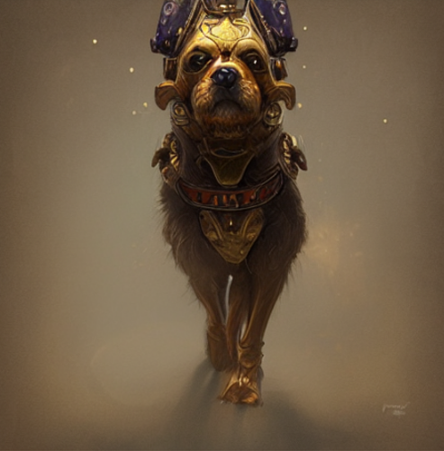

***EN***

# Project

Image generation using GANs (generative adversarial networks) and also fuzzy networks. An AI consultancy that was hired by a marketing company that wants to have its own image generator, without depending on an API, ensuring that there will be no copyright issues. The company wants to create an image generator for products, specifically clothes using a dataset called "Fashion MNIST" that will allow us to create images of clothes.

    <em>Image Generator with Fashion MNIST and Stable Diffusion</em>:

This project implements a generative network to generate images from the Fashion MNIST dataset using deep learning techniques, including GANs and Stable Diffusion. The goal is to explore different approaches for image generation and enhancement.

📌 Features Developed

🔹 Data Preparation

- Loading the Fashion MNIST dataset.
- Normalizing images to the range [-1, 1] to improve model performance.

🔹 Generator Construction
- Implementing a generator network using transposed convolution layers.

- Including normalization and activation layers to enhance image quality.

- Generating images from a noise vector of 100 random numbers, with visualization via Matplotlib.

🔹 Discriminator Implementation

- Building the discriminator network with convolution layers.

- Using activation functions and dropout to improve model regularization.

🔹 Generative Network Training

- Defining loss functions for training the generator and discriminator networks.

- Implementing a training loop to adjust network weights over 50 epochs.

- Monitoring the evolution of image generation.

🔹 Model Saving and Retrieval

- Storing the generator model for future image generation without the need for retraining.

🔹 Additional Enhancements

- Adding noise and expanding image dimensions to diversify the data.

- Implementing and training a U-Net to improve image quality.

- Creating a prediction function based on the trained U-Net.

- Generating images using Stable Diffusion.

- Improving model accuracy.

- Implementing a mixed prediction approach combining different techniques.

- Generating smoother image sequences with more frames using batch encoding interpolation, optimizing performance for animations.

🚀 How to Run the Project

1. Clone this repository:

        git clone https://github.com/Cr0l3y/G_IMG_Fashion.git

2. Install the required dependencies:

        pip install -r requirements.txt 

3. Train the model:

        python train.py

4. Generate new images from the trained model:

        python generate.py

📚  Technologies Used

- Python

- TensorFlow / PyTorch

- Matplotlib

- NumPy

- OpenCV

- Stable Diffusion

---
***PT-BR***

# Projeto

 Geração de imagens utilizando GANs (generative adversarial network ou redes generativas adversativas) e também as redes difusoras. Uma consultoria de IA que foi contratada por uma empresa de marketing que quer ter seu próprio gerador de imagens, sem depender de uma API, garantindo que não haverá problemas com direitos autorais.A empresa quer criar um gerador de imagens para produtos, especificamente roupas utilizando um dataset chamado de "Fashion MNIST" que nos permitirá criar imagens de roupas.

    <em>Gerador de Imagens com Fashion MNIST e Stable Diffusion</em>:

Este projeto implementa uma rede generativa para gerar imagens a partir do dataset Fashion MNIST, utilizando técnicas de aprendizado profundo, incluindo GANs e Stable Diffusion. O objetivo é explorar diferentes abordagens para a geração e aprimoramento de imagens.

📌 Funcionalidades Desenvolvidas

🔹 Preparação dos Dados

- Carregamento do dataset Fashion MNIST.
- Normalização das imagens para o intervalo [-1, 1] para melhorar a performance do modelo.

🔹 Construção do Gerador
- Implementação de uma rede geradora utilizando camadas de convolução transposta.

- Inclusão de camadas de normalização e ativação para melhorar a qualidade das imagens geradas.

- Geração de imagens a partir de um vetor de ruído de 100 números aleatórios, com visualização via Matplotlib.

🔹 Implementação do Discriminador

- Construção da rede discriminadora com camadas de convolução.

- Utilização de funções de ativação e dropout para melhorar a regularização do modelo.

🔹 Treinamento da Rede Generativa
- Definição das funções de custo para o treinamento das redes geradora e discriminadora.

- Implementação de um loop de treinamento ajustando os pesos das redes ao longo de 50 épocas.

- Monitoramento da evolução da geração de imagens.

🔹 Salvamento e Recuperação do Modelo

- Armazenamento do modelo gerador para geração de imagens futuras sem necessidade de novo treinamento.

🔹 Aprimoramentos Adicionais

- Adição de ruído e expansão da dimensão das imagens para diversificar os dados.

- Implementação de uma U-Net e treinamento para melhorar a qualidade das imagens.

- Criação de uma função de previsão baseada na U-Net treinada.

- Geração de imagens utilizando Stable Diffusion.

- Ajustes para melhorar a precisão do modelo.

- Implementação de uma previsão mista combinando diferentes abordagens.

- Geração de sequências de imagens mais suaves e com mais quadros usando interpolação de encodings em lotes, otimizando o desempenho para animações.

🚀 Como Executar o Projeto

1. Clone este repositório:

        git clone https://github.com/Cr0l3y/G_IMG_Fashion.git

2. Instale as dependências necessárias:

        pip install -r requirements.txt 

3. Execute o treinamento do modelo:

        python train.py

4. Gere novas imagens a partir do modelo treinado:

        python generate.py

📚 Tecnologias Utilizadas

- Python

- TensorFlow / PyTorch

- Matplotlib

- NumPy

- OpenCV

- Stable Diffusion

